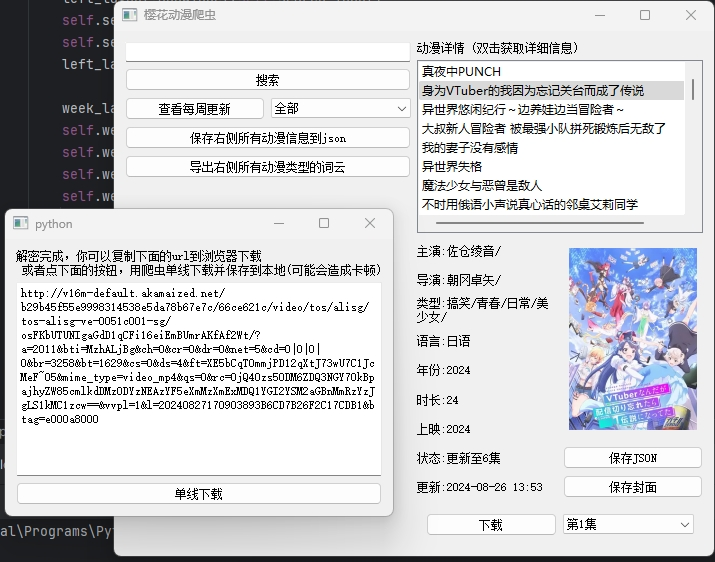
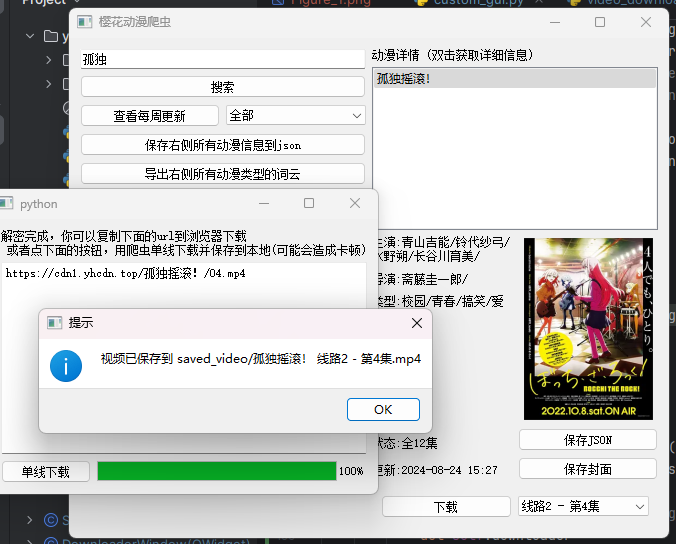

# yinghua_spider

用bs4和pyqt5写的樱花动漫 (yinghua.uk) 爬虫，仅用于学习用途，交学校作业

使用方法: `python3 yinghua_spider.py`

*史一样的GUI*

依赖项: pillow, bs4, pyqt5, requests

wordcloud, matplotlib

已完成:
1. 获取每周更新的动漫
2. 获取动漫的封面和详细信息
3. 保存动漫信息到本地
4. 可以分批保存Json
5. 可以搜索动漫并查看分集
6. 使用PyQT5的GUI
7. 可以下载视频，支持线路1线路2 (线路1经常崩)
8. 可以根据搜索的动漫类型生成词云图
9. **反爬**: 爬取线路1播放器并对后端返回的AES URL进行解密

todo:
1. excel分析
2. 多线程下载器